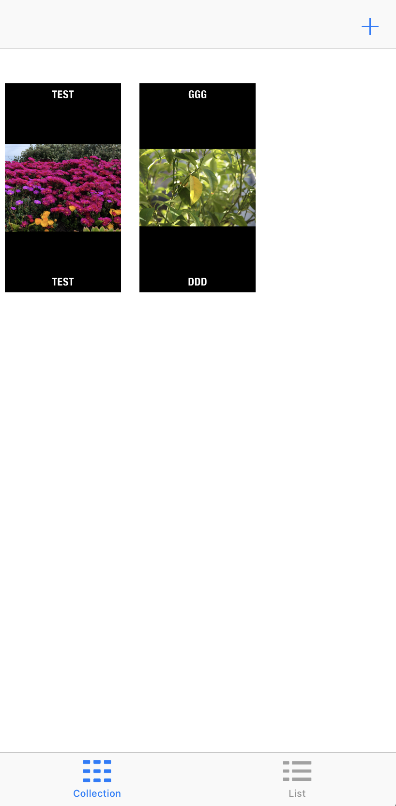
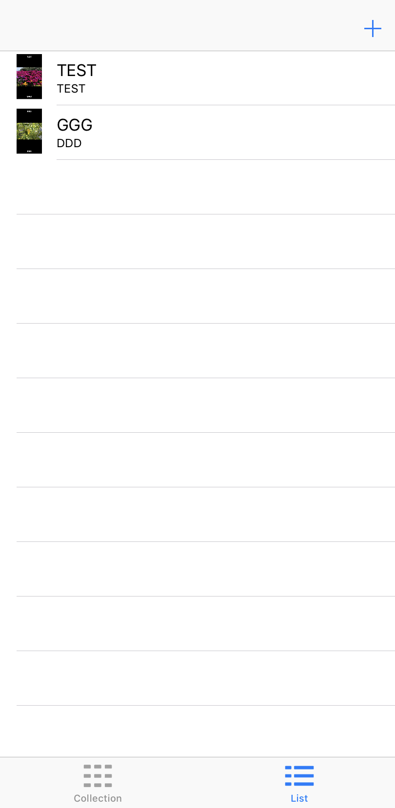
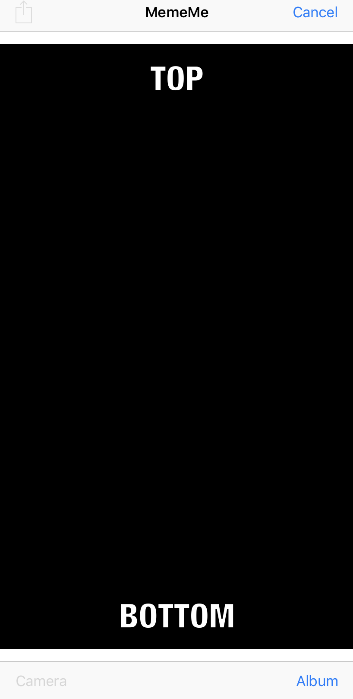

# MemeMe-V2
IOS app that creates Mems from photo libarary or camera and list the memes in table view and collection view. Udacity project

## How to run
* Download or clone repo 
* open PitchPerfect.xcodeproj file
* run

## Screen Shots

 
